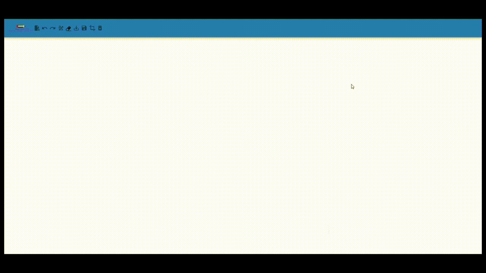
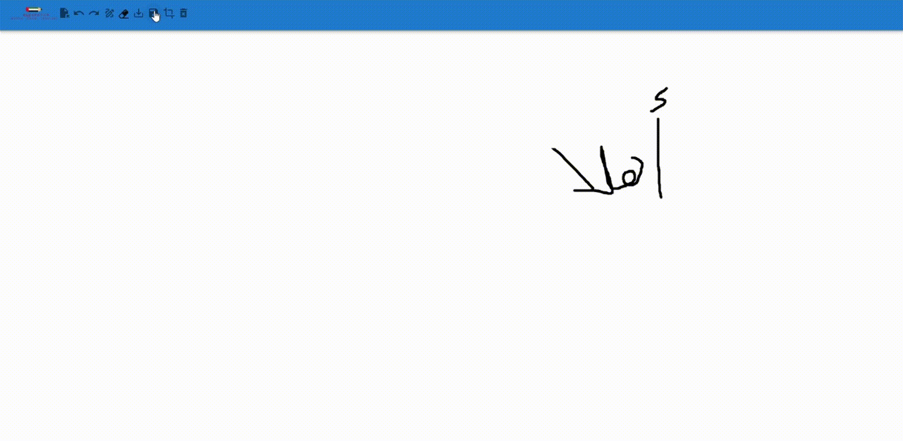
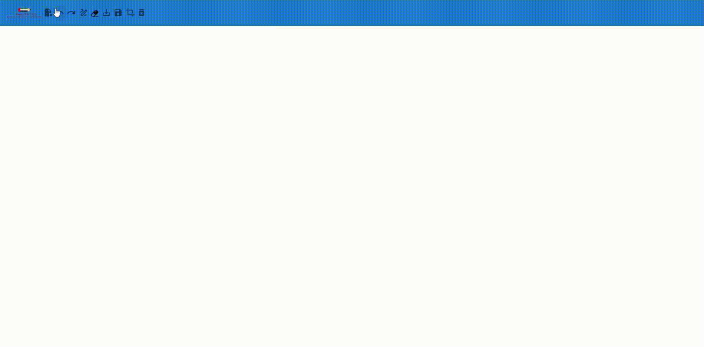
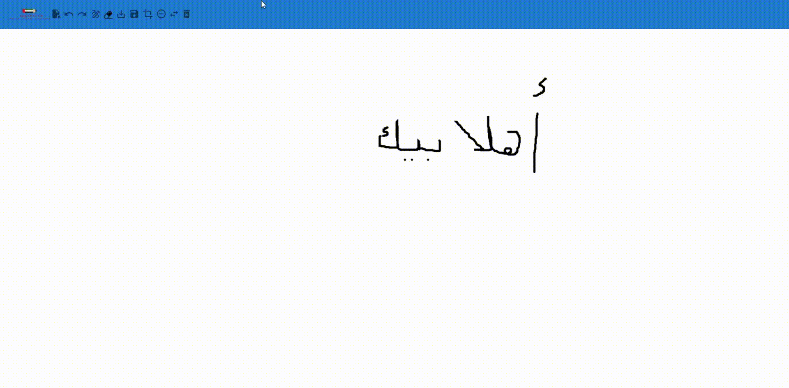
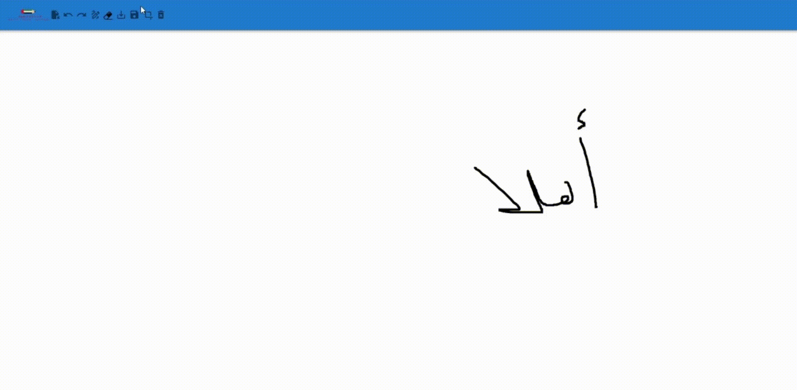
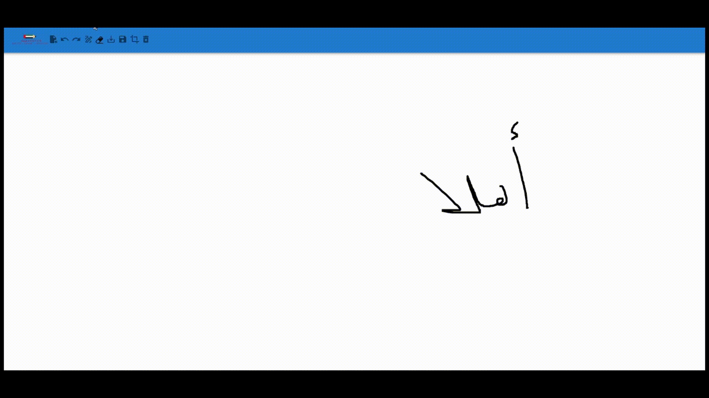

# 2ABDOH-Sketch

<p align="center">
  
</p>
A web application which allows to save sketchs as images and vector files. It's also able to manipulate data by using open, update, crop, redo, undo, erase, & clear all.

## Badges


[](https://www.javascript.com/)
[](https://mui.com)
[](https://git-scm.com)
[](https://github.com)
[](https://codepen.io/trending)
[](https://prettier.io)
[](https://www.youtube.com)
[![VSCode](https://img.shields.io/badge/VSCode-blue?style=for-the-badge&logo=data:image/svg+xml;base64,PHN2ZyB3aWR0aD0iMTAwIiBoZWlnaHQ9IjEwMCIgZmlsbD0ibm9uZSIgeG1sbnM9Imh0dHA6Ly93d3cudzMub3JnLzIwMDAvc3ZnIj48ZyBmaWx0ZXI9InVybCgjYikiIGNsaXAtcGF0aD0idXJsKCNhKSI+PG1hc2sgaWQ9ImMiIG1hc2stdHlwZT0iYWxwaGEiIG1hc2tVbml0cz0idXNlclNwYWNlT25Vc2UiIHg9IjAiIHk9IjAiIHdpZHRoPSIxMDAiIGhlaWdodD0iMTAwIj48cGF0aCBmaWxsLXJ1bGU9ImV2ZW5vZGQiIGNsaXAtcnVsZT0iZXZlbm9kZCIgZD0iTTcwLjkxMiA5OS41NzJhNi4xOTMgNi4xOTMgMCAwIDAgNC45Ni0uMTkxbDIwLjU4OC05Ljk1OGE2LjI4NSA2LjI4NSAwIDAgMCAzLjU0LTUuNjYxVjE2LjIzOWE2LjI4NiA2LjI4NiAwIDAgMC0zLjU0LTUuNjYyTDc1Ljg3My42MmE2LjIgNi4yIDAgMCAwLTcuMTA0IDEuMjE2TDI5LjM1NSAzNy45OGwtMTcuMTY4LTEzLjFhNC4xNDYgNC4xNDYgMCAwIDAtNS4zMTguMjM4bC01LjUwNiA1LjAzNWE0LjIwNSA0LjIwNSAwIDAgMC0uMDA0IDYuMTk0TDE2LjI0NyA1MCAxLjM2IDYzLjY1NGE0LjIwNSA0LjIwNSAwIDAgMCAuMDA0IDYuMTk0bDUuNTA2IDUuMDM0YTQuMTQ1IDQuMTQ1IDAgMCAwIDUuMzE4LjIzOGwxNy4xNjgtMTMuMUw2OC43NyA5OC4xNjZhNi4yMDUgNi4yMDUgMCAwIDAgMi4xNDMgMS40MDdabTQuMTAzLTcyLjM5TDQ1LjExIDUwIDc1LjAxNSA3Mi44MlYyNy4xOFoiIGZpbGw9IiNmZmYiLz48L21hc2s+PGcgbWFzaz0idXJsKCNjKSI+PHBhdGggZD0iTTk2LjQ2MSAxMC41OTMgNzUuODU3LjYyMWE2LjIwNSA2LjIwNSAwIDAgMC03LjEwNyAxLjIxNEwxLjI5OCA2My42NTRhNC4yMDMgNC4yMDMgMCAwIDAgLjAwNSA2LjE5NGw1LjUxIDUuMDM0YTQuMTUgNC4xNSAwIDAgMCA1LjMyLjIzOEw5My4zNiAxMy4xOGMyLjcyNS0yLjA3OCA2LjY0LS4xMjQgNi42NCAzLjMxNHYtLjI0YTYuMjg3IDYuMjg3IDAgMCAwLTMuNTM5LTUuNjYxWiIgZmlsbD0iI0Q5RDlEOSIvPjxnIGZpbHRlcj0idXJsKCNkKSI+PHBhdGggZD0iTTk2LjQ2MSA4OS40MDcgNzUuODU3IDk5LjM4YTYuMjA1IDYuMjA1IDAgMCAxLTcuMTA3LTEuMjE1TDEuMjk4IDM2LjM0NmE0LjIwMyA0LjIwMyAwIDAgMSAuMDA1LTYuMTk0bDUuNTEtNS4wMzRhNC4xNSA0LjE1IDAgMCAxIDUuMzItLjIzOEw5My4zNiA4Ni44MmMyLjcyNSAyLjA3OSA2LjY0LjEyNSA2LjY0LTMuMzE0di4yNDFhNi4yODcgNi4yODcgMCAwIDEtMy41MzkgNS42NloiIGZpbGw9IiNFNkU2RTYiLz48L2c+PGcgZmlsdGVyPSJ1cmwoI2UpIj48cGF0aCBkPSJNNzUuODU4IDk5LjM4YTYuMjA2IDYuMjA2IDAgMCAxLTcuMTA4LTEuMjE1YzIuMzA2IDIuMzE4IDYuMjUuNjc2IDYuMjUtMi42MDJWNC40MzdjMC0zLjI3OC0zLjk0NC00LjkyLTYuMjUtMi42MDJBNi4yMDggNi4yMDggMCAwIDEgNzUuODU4LjYxOWwyMC42IDkuOTU4QTYuMjg2IDYuMjg2IDAgMCAxIDEwMCAxNi4yNHY2Ny41MjNhNi4yODYgNi4yODYgMCAwIDEtMy41NDIgNS42NjFsLTIwLjYgOS45NThaIiBmaWxsPSIjZmZmIi8+PC9nPjxwYXRoIHN0eWxlPSJtaXgtYmxlbmQtbW9kZTpvdmVybGF5IiBvcGFjaXR5PSIuMjUiIGZpbGwtcnVsZT0iZXZlbm9kZCIgY2xpcC1ydWxlPSJldmVub2RkIiBkPSJNNzAuODUgOTkuNTcyYTYuMTkzIDYuMTkzIDAgMCAwIDQuOTYyLS4xOTFMOTYuNCA4OS40MjNhNi4yODQgNi4yODQgMCAwIDAgMy41MzktNS42NjFWMTYuMjM5YTYuMjg1IDYuMjg1IDAgMCAwLTMuNTM5LTUuNjYyTDc1LjgxMS42MmE2LjIgNi4yIDAgMCAwLTcuMTAzIDEuMjE2TDI5LjI5NCAzNy45OGwtMTcuMTY4LTEzLjFhNC4xNDYgNC4xNDYgMCAwIDAtNS4zMTguMjM4bC01LjUwNiA1LjAzNGE0LjIwNSA0LjIwNSAwIDAgMC0uMDA0IDYuMTk0TDE2LjE4NiA1MCAxLjI5NyA2My42NTRhNC4yMDUgNC4yMDUgMCAwIDAgLjAwNSA2LjE5NGw1LjUwNiA1LjAzNGE0LjE0NiA0LjE0NiAwIDAgMCA1LjMxOC4yMzhsMTcuMTY4LTEzLjEgMzkuNDE0IDM2LjE0NWE2LjIwNSA2LjIwNSAwIDAgMCAyLjE0MyAxLjQwN1ptNC4xMDQtNzIuMzlMNDUuMDQ4IDUwbDI5LjkwNiAyMi44MTlWMjcuMThaIiBmaWxsPSJ1cmwoI2YpIi8+PC9nPjwvZz48ZGVmcz48ZmlsdGVyIGlkPSJiIiB4PSItNi4yNSIgeT0iLTQuMTY3IiB3aWR0aD0iMTEyLjUiIGhlaWdodD0iMTEyLjUiIGZpbHRlclVuaXRzPSJ1c2VyU3BhY2VPblVzZSIgY29sb3ItaW50ZXJwb2xhdGlvbi1maWx0ZXJzPSJzUkdCIj48ZmVGbG9vZCBmbG9vZC1vcGFjaXR5PSIwIiByZXN1bHQ9IkJhY2tncm91bmRJbWFnZUZpeCIvPjxmZUNvbG9yTWF0cml4IGluPSJTb3VyY2VBbHBoYSIgdmFsdWVzPSIwIDAgMCAwIDAgMCAwIDAgMCAwIDAgMCAwIDAgMCAwIDAgMCAxMjcgMCIvPjxmZU9mZnNldCBkeT0iMi4wODMiLz48ZmVHYXVzc2lhbkJsdXIgc3RkRGV2aWF0aW9uPSIzLjEyNSIvPjxmZUNvbG9yTWF0cml4IHZhbHVlcz0iMCAwIDAgMCAwIDAgMCAwIDAgMCAwIDAgMCAwIDAgMCAwIDAgMC4xNSAwIi8+PGZlQmxlbmQgaW4yPSJCYWNrZ3JvdW5kSW1hZ2VGaXgiIHJlc3VsdD0iZWZmZWN0MV9kcm9wU2hhZG93Ii8+PGZlQmxlbmQgaW49IlNvdXJjZUdyYXBoaWMiIGluMj0iZWZmZWN0MV9kcm9wU2hhZG93IiByZXN1bHQ9InNoYXBlIi8+PC9maWx0ZXI+PGZpbHRlciBpZD0iZCIgeD0iLTguMzk0IiB5PSIxNS42OTUiIHdpZHRoPSIxMTYuNzI4IiBoZWlnaHQ9IjkyLjYzOCIgZmlsdGVyVW5pdHM9InVzZXJTcGFjZU9uVXNlIiBjb2xvci1pbnRlcnBvbGF0aW9uLWZpbHRlcnM9InNSR0IiPjxmZUZsb29kIGZsb29kLW9wYWNpdHk9IjAiIHJlc3VsdD0iQmFja2dyb3VuZEltYWdlRml4Ii8+PGZlQ29sb3JNYXRyaXggaW49IlNvdXJjZUFscGhhIiB2YWx1ZXM9IjAgMCAwIDAgMCAwIDAgMCAwIDAgMCAwIDAgMCAwIDAgMCAwIDEyNyAwIi8+PGZlT2Zmc2V0Lz48ZmVHYXVzc2lhbkJsdXIgc3RkRGV2aWF0aW9uPSI0LjE2NyIvPjxmZUNvbG9yTWF0cml4IHZhbHVlcz0iMCAwIDAgMCAwIDAgMCAwIDAgMCAwIDAgMCAwIDAgMCAwIDAgMC4yNSAwIi8+PGZlQmxlbmQgbW9kZT0ib3ZlcmxheSIgaW4yPSJCYWNrZ3JvdW5kSW1hZ2VGaXgiIHJlc3VsdD0iZWZmZWN0MV9kcm9wU2hhZG93Ii8+PGZlQmxlbmQgaW49IlNvdXJjZUdyYXBoaWMiIGluMj0iZWZmZWN0MV9kcm9wU2hhZG93IiByZXN1bHQ9InNoYXBlIi8+PC9maWx0ZXI+PGZpbHRlciBpZD0iZSIgeD0iNjAuNDE3IiB5PSItOC4zMzMiIHdpZHRoPSI0Ny45MTciIGhlaWdodD0iMTE2LjY2NyIgZmlsdGVyVW5pdHM9InVzZXJTcGFjZU9uVXNlIiBjb2xvci1pbnRlcnBvbGF0aW9uLWZpbHRlcnM9InNSR0IiPjxmZUZsb29kIGZsb29kLW9wYWNpdHk9IjAiIHJlc3VsdD0iQmFja2dyb3VuZEltYWdlRml4Ii8+PGZlQ29sb3JNYXRyaXggaW49IlNvdXJjZUFscGhhIiB2YWx1ZXM9IjAgMCAwIDAgMCAwIDAgMCAwIDAgMCAwIDAgMCAwIDAgMCAwIDEyNyAwIi8+PGZlT2Zmc2V0Lz48ZmVHYXVzc2lhbkJsdXIgc3RkRGV2aWF0aW9uPSI0LjE2NyIvPjxmZUNvbG9yTWF0cml4IHZhbHVlcz0iMCAwIDAgMCAwIDAgMCAwIDAgMCAwIDAgMCAwIDAgMCAwIDAgMC4yNSAwIi8+PGZlQmxlbmQgbW9kZT0ib3ZlcmxheSIgaW4yPSJCYWNrZ3JvdW5kSW1hZ2VGaXgiIHJlc3VsdD0iZWZmZWN0MV9kcm9wU2hhZG93Ii8+PGZlQmxlbmQgaW49IlNvdXJjZUdyYXBoaWMiIGluMj0iZWZmZWN0MV9kcm9wU2hhZG93IiByZXN1bHQ9InNoYXBlIi8+PC9maWx0ZXI+PGxpbmVhckdyYWRpZW50IGlkPSJmIiB4MT0iNDkuOTM5IiB5MT0iMCIgeDI9IjQ5LjkzOSIgeTI9IjEwMC4wMDEiIGdyYWRpZW50VW5pdHM9InVzZXJTcGFjZU9uVXNlIj48c3RvcCBzdG9wLWNvbG9yPSIjZmZmIi8+PHN0b3Agb2Zmc2V0PSIxIiBzdG9wLWNvbG9yPSIjZmZmIiBzdG9wLW9wYWNpdHk9IjAiLz48L2xpbmVhckdyYWRpZW50PjxjbGlwUGF0aCBpZD0iYSI+PHBhdGggZmlsbD0iI2ZmZiIgZD0iTTAgMGgxMDB2MTAwSDB6Ii8+PC9jbGlwUGF0aD48L2RlZnM+PC9zdmc+)](https://code.visualstudio.com/)

## Motivation

Bringing _convenience_, _speed_, and _ease of use_ to the sketch app is the primary objective.

The application 2ABDOH, which stands for 2D Arabic Based Dataset Of Handwritten Scripts, is a sketch app used as a tool to gather data with ease.

The aim here is to create a large and diverse Arabic Dataset that will help in further studies. The dataset & the Deep Learning model used are found in the repository for [Arabic Image Classifier Model](https://github.com/OmarAhmedAdel/Arabic-Image-Classifier-Model.git).

The logo depicts the freedom people can have to express their true thoughts about all the ideas they've, struggles they face, or dreams they want to achieve. It also indicates what people stand for: _Freedom_ & _Justice_

## Features

<details>
  <summary> Draw The Strokes </summary>
  
  - Using a mouse or a touch input, users can freely draw on the canvas.
  - The application records all the coordinates of the strokes made by the user as a sequence of vector coordinates (x and y) that show the course of the drawing.
  - These coordinates are kept in the RAM.
    
</details>
<details>
  <summary> Save As PNG </summary>

- The application turns all the content in the current canvas, including all drawn strokes, into a PNG image format when the user selects the "Save as image" icon.

</details>
<details>
  <summary> Save As INKML File </summary>

- The web app allows users to save sketches in Inkml format in addition to PNG.
- This is done by storing all the coordinates and other related information, converting the drawn strokes into an Inkml document by clicking on the "Save as Inkml" icon.​

</details>
<details>
  <summary> Open & Redraw INKML File </summary>

- By opening Inkml files using the "Open File" icon, the web app enables the users to view and edit previously saved sketches.
- This happens by reading the Inkml content and redraws the saved vector coordinates after a file is selected.
- With such capability, users can continue working on their sketches or edit ones that already exist.​

</details>
<details>
  <summary> Update & Save in New File </summary>

- The web app allows to add new strokes to opened files in addition to redrawing already-existing designs.
- After that, users can save the revised sketch as a new file, keeping both the added and original strokes.

</details>
<details>
  <summary> Crop Strokes From INKML Files </summary>

- The sketch has a cropping function based on stroke counts to make selective editing or analyzing sketches easier.
- Users can specify a range of strokes to be included in the cropped version of the sketch by entering the start and finish stroke numbers.
- To select the strokes, users should first increase the end stroke before increasing the start stroke and the opposite when decreasing. This is to make sure that end stroke is not less than the start stroke & the start stroke is not greater than the end stroke.
- This feature improves editing precision and flexibility by enabling users to isolate and work with specific areas of their drawings. This can happen by clicking on the "Crop Drawings" icon.

</details>
<details>
  <summary> Remove Strokes From INKML Files </summary>

- Users can specify which strokes to remove, effectively removing unwanted elements while retaining the rest of the sketch.
- Unlike the "Crop Strokes" function, which saves selected strokes and removes the rest, "Remove Strokes" deletes selected strokes and preserves the remaining content.
- To select the strokes, users should first increase the end stroke before increasing the start stroke and the opposite when decreasing. This is to make sure that end stroke is not less than the start stroke & the start stroke is not greater than the end stroke.
- This feature offers enhanced flexibility in sketch editing by allowing users to refine their designs without starting over. This can happen by clicking on the "Remove Drawings" icon.

</details>
<details>
  <summary> Shift Strokes From INKML Files </summary>

- Users can select specific strokes and move them vertically or horizontally across the canvas boundaries.
- This can happen by defining the shift distance in increments or decrements, such as 10, 20, 30, or customize it further (e.g., 11, 22, 33) etc.
- To select the strokes, users should first increase the end stroke before increasing the start stroke and the opposite when decreasing. This is to make sure that end stroke is not less than the start stroke & the start stroke is not greater than the end stroke.
- This capability improves the editing precision by enabling users to reposition parts of their sketches effectively. This can happen by clicking on the "Shift Drawings" icon.

</details>
<details>
  <summary> Undo & Redo </summary>

- Users can use the undo, redo, and erase features, as basic features among other crucial editing tools.
- Users can return to and undo actions to restore the drawing to its earlier states by using the undo function.
- On the other hand, users can reapply undone operations using the redo tool, which gives them more editing flexibility.

</details>
<details>
  <summary> Erase The Strokes </summary>

- To improve accuracy in corrections and modifications, users can also selectively erase portions of the sketch using the erase function.
- Erace can work when hovering on a drawing with no need at all for mouse input.
- These actions are accessible by clicking on "Undo", "Redo", and "Erase" icons. Moreover, users can switch from erasing to drawing by clicking on the "Draw" icon and vice versa.

</details>
<details>
  <summary> Clear All </summary>

- This is responsible for deleting all the strokes drawn on the sketch and removing any opened item in the RAM by clicking on the "Clear All" icon.

</details>

## Installation & Run the App

To install the project with `npm`, run the following commands in order.

```bash
> git clone https://github.com/OmarAhmedAdel/2ABDOH-Sketch.git
> cd src
> npm i
```

And to run the app, run the following command

```bash
> npm start
```
